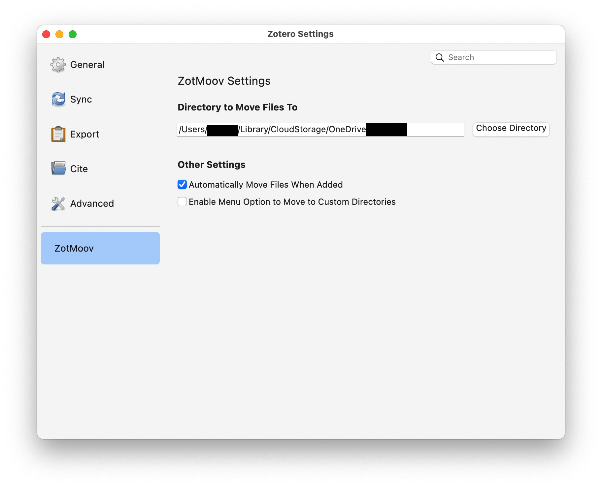

# ZotMoov
A *simple* plugin for managing attachments in Zotero 7

ZotMoov can:
- Automatically move/copy imported attachments into a custom directory
- Manually move/copy imported attachments into a custom directory via right-clicking
- Automatically delete linked attachments from your computer when you delete them in Zotero
- Easily attach the last modified file in a folder to a Zotero item

## Installation

[Download the latest release here](https://github.com/wileyyugioh/zotmoov/releases/latest)
- If using Firefox you have to right click the .xpi and save link as.

And set the ZotMoov directory to the folder you want to move/copy files to.

It is highly recommended to
1. **[Make a local backup before mooving your library](https://www.zotero.org/support/zotero_data#backing_up_your_zotero_data)**
2. Give ZotMoov its own folder that other applications will not alter
3. Uncheck "Sync attachment files in My Library" in the Sync settings if you do not plan to use Zotero's cloud file storage
4. If planning to sync across multiple devices, set the [Linked Attachment Base Directory](https://www.zotero.org/support/preferences/advanced#linked_attachment_base_directory) to the synced folder on each computer.

## FAQ

### Migrating from ZotFile

ZotMoov should not break any existing linked files from ZotFile. But to be sure, before updating to Zotero 7 [make a local backup of your library](https://www.zotero.org/support/zotero_data#backing_up_your_zotero_data) and of your ZotFile folder.

The ZotMoov data directory can be the previous ZotFile directory if you don't mind new files being mixed with the old ones, or a brand new data directory if you like to keep things separate.

One problem that might arise is the [Linked Attachment Base Directory](https://www.zotero.org/support/preferences/advanced#linked_attachment_base_directory). If you were using this feature before (check in Settings > Advanced > Files and Folders > Linked Attachment Base Directory) you may need to change the base directory to a folder that contains both the ZotFile files and the ZotMoov files.

The easiest way to accomplish this is to simply reuse the ZotFile folder or put the ZotMoov folder inside the previous ZotFile one. For example, the ZotMoov data folder will be `ZotFile/` or `ZotFile/ZotMoov/` respectively.

### File Renaming

I recommend using the [automatic file renaming functionality included in Zotero 7](https://www.zotero.org/support/file_renaming). It has support for custom patterns.

### Moving Files in Group Libraries

[Zotero does not support linked files for group libraries](https://www.zotero.org/support/attaching_files#linked_files), so ZotMoov can only move files in your personal library. Any linked files pointing to group libraries that are somehow created will be broken. The `copy` feature is unaffected by this limitation.

### Bugs/Feature Requests

Both can be filed [here](https://github.com/wileyyugioh/zotmoov/issues). Please keep feature requests tightly focused on the extension's core purpose of mooving attachments and linking them!

## [Settings](docs/SETTINGS_INFO.md)