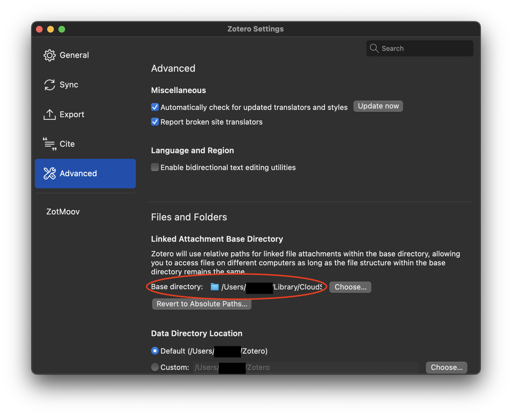

# ZotMoov
A *simple* plugin for Zotero 7 that mooves attachments and links them.

ZotMoov can automatically move added attachments into the directory of your choosing, or you can opt to manually move and link each file into their own respective directory.

## Installation

[Download the latest release here](https://github.com/wileyyugioh/zotmoov/releases)

Note that you have to right click the .xpi and save link as.

To set up with 3rd party syncing services, set the Linked Attachment Base Directory to the synced folder.

Then point ZotMoov to that same folder.

If you want to moove already existing files to the ZotMoov directory, you can right click them and use the appropriate menu item.

## FAQ

### File Renaming

I recommend using the [automatic file renaming functionality included in Zotero 7](https://www.zotero.org/support/file_renaming). It has support for custom patterns. You will have to enable “Rename linked files” from the General pane of the Zotero settings.

### Bugs/Feature Requests

Both can be filed [here](https://github.com/wileyyugioh/zotmoov/issues). Please keep feature requests tightly focused on the extension's core purpose of mooving attachments and linking them!

## Settings

### Directory to Move Files To

The base directory where ZotMoov will move/copy files

### File Behavior

By default ZotMoov will move and link your files. You can change the dropdown menu option to `copy` for ZotMoov to just make a back-up of your added files in the specified directory.

### Automatically Move/Copy Files to Subdirectory

When this is enabled, ZotMoov will automatically move files into a custom subdirectory. By default it is `{%c}` which is by item collection. [Click here for the formatting options](https://github.com/wileyyugioh/zotmoov/blob/master/docs/WILDCARD_INFO.md)

### Automatically Delete External Linked Files in the ZotMoov Directory

When this is enabled, ZotMoov will automatically delete linked files in the ZotMoov Directory. Meaning that when you trash/permanently delete a file with this option enabled in Zotero, and it is a linked file in the ZotMoov directory, it will also get deleted on your hard drive.

### Allowed File Extensions

By adding/removing entries to this table via the [+] and [-] buttons, you can choose which types of files ZotMoov will automatically move. If the table is empty, then all files will be moved regardless of their file extension.