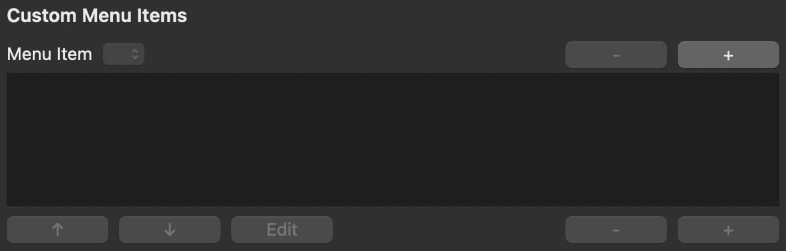
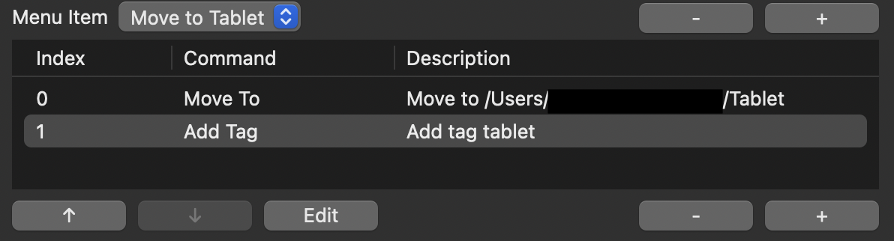
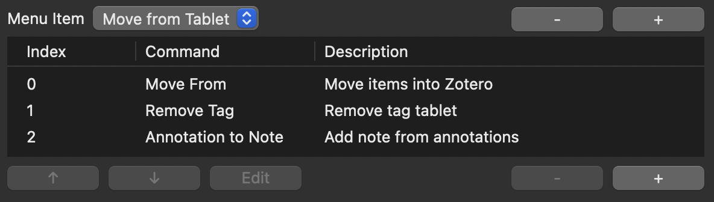

# ZotMoov Custom Menu Items

Users have the ability to create their own custom menu items in ZotMoov, appearing in the context menu when you right-click an item. They can be created in Advanced Options.

1. Select the top [+] to create a new menu item. Give it a title that you want to appear in the context menu.
2. Select the bottom [+] to add a new command.
3. Press [+] to add subsequent commands. You can remove a command by [-] or change the order it is run in by [↑] or [↓]. You can also edit it using the edit button.
4. To delete the menu item, select it on the top dropdown menu and press the top [-].

## Menu Item Commands

### Move To

Move items.

Input: A list of items

Output: A list of successfully moved items

- Enable Custom Directory: Allows you to override the general setting and instead move the files to another directory
- Automatically Move/Copy Files to a Subdirectory: Choose whether or not subdirectory folders will be created

### Copy To

Copy items.

Input: A list of items

Output: A list of successfully copied items

- Enable Custom Directory: Allows you to override the general setting and instead move the files to another directory
- Automatically Move/Copy Files to a Subdirectory: Choose whether or not subdirectory folders will be created

### Add Tag

Add tag to items.

Input: A list of items

Output: The same list of items

### Remove Tag

Remove tag from items.

Input: A list of items

Output: The same list of items

### Move From

Move files **into** Zotero. Behaves like the Move Selected from Directory menu item.

Input: A list of items

Output: A list of items successfully moved into Zotero

### Annotation to Note

Extract annotations from a PDF and convert it into a Zotero note. Uses Zotero's internal functionality for this.

Input: A list of items

Output: The same list of items

## Examples

