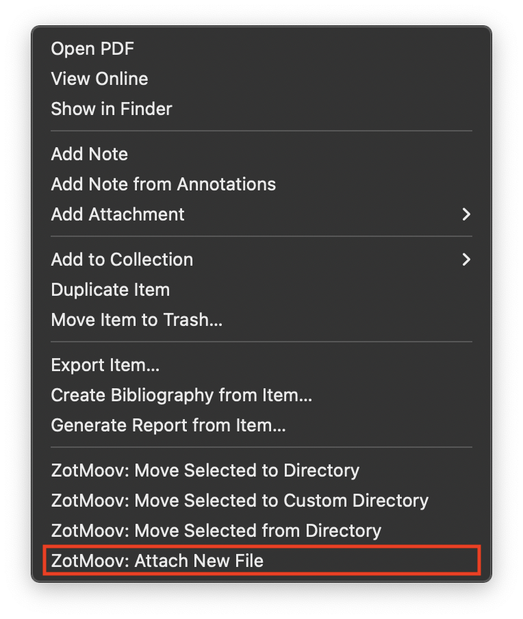

# ZotMoov Settings

## Directory to Move Files To

The base directory where ZotMoov will move/copy files


## File Behavior

By default ZotMoov will move and link your files. You can change the dropdown menu option to ```copy``` for ZotMoov to make an external back-up of your added files in the specified directory. Note that files that are copied via ```copy``` will not be tracked by Zotero anymore. Most users will want this set to ```move```.

## Automatically Move/Copy Files When Added

When this is enabled, ZotMoov will automatically move/copy files whenever they are imported into Zotero. The types of files can be restricted by the **Allowed File Extensions** option.

## Automatically Move/Copy Files to Subdirectory

When this is enabled, ZotMoov will automatically move files into a custom subdirectory whenever
- a file is moved/copied via **Automatically Move/Copy Files When Added**
- the Move/Copy Selected to Directory menu option is used

By default the subdirectory string is `{%c}` which is by item collection. [Click here for the formatting options](WILDCARD_INFO.md)

## Automatically Delete External Linked Files in the ZotMoov Directory

When this is enabled, ZotMoov will automatically delete linked files in the ZotMoov directory. Meaning that when you permanently delete a linked file in Zotero, and that linked file points to a file in the ZotMoov directory, the file on your hard drive will be deleted. It will also delete any empty directories within the ZotMoov directory.

## Allowed File Extensions

By adding/removing entries to this table via the [+] and [-] buttons, you can choose which types of files ZotMoov will move/copy. If the table is empty, then all files will be moved regardless of their file extension.

## Advanced Options

### Search Folder for Attaching New Files

When checked this will enable the Attach New File menu item.



When this button is clicked, the last modified file in the Search Folder with an allowed file extension will be attached to the selected item.

[Custom Wildcards](CUSTOM_WILDCARD_INFO.md)

[Custom Menu Items](CUSTOM_MENUITEM_INFO.md)

## Selected Hidden Preferences

[Hidden preferences can be accessed/modified to change some of ZotMoov's behavior](https://www.zotero.org/support/preferences/hidden_preferences)

```extensions.zotmoov.rename_title```: Enable/disable custom title renaming over the Zotero default

```extensions.zotmoov.undefined_str```: The string of the `%U` wildcard

```extensions.zotmoov.add_zotmoov_tag```: Enable/disable whether the ```zotmoov``` tag is added to processed items
